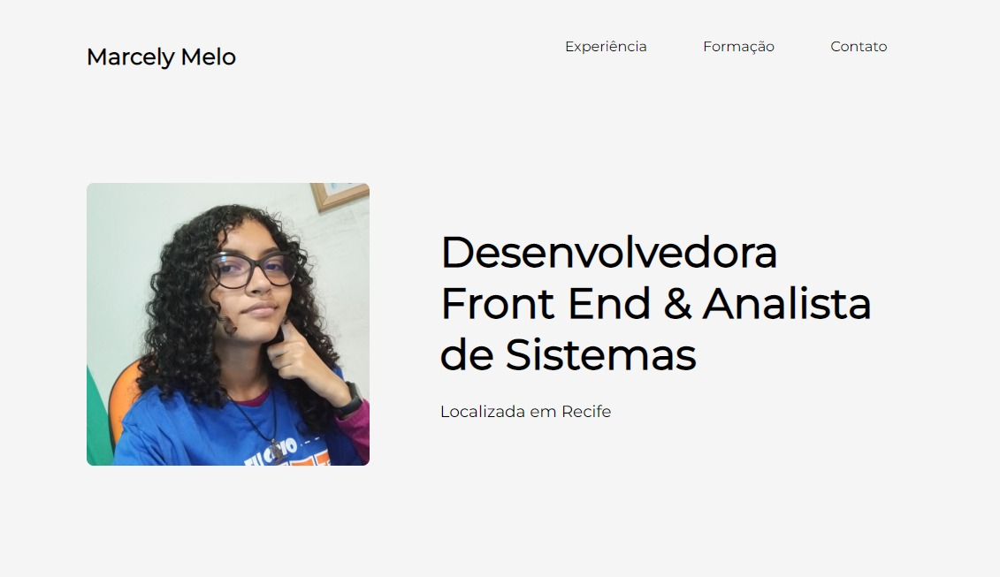

<h1 align="center">Portfólio Avaliação Front End</h1>

  <h3>
  Acesse 
    <a href="https://marcelymelo.github.io/Portfolio-front-end-test/">
      aqui
    </a> o projeto!
  </h3>

- [Overview](#overview)
  - [Built With](#built-with)
- [Contact](#contact)

<!-- OVERVIEW -->

## Overview

Este projeto foi idealizado e realizado com a itenção de servir como avaliação para a cadeira de Front End, lecionada pelo professor Flávio Fonseca. 
Desenvolvido utilizando HTML, SCSS e JavaScript. Estou aberta a críticas construtivas para melhorar o projeto e planejo estar sempre o alimentando com novas funcionalidades e atualizações sobre mim.

### Built With

<!-- This section should list any major frameworks that you built your project using. Here are a few examples.-->

- [HTML](https://pt.wikipedia.org/wiki/HTML)
- [CSS](https://pt.wikipedia.org/wiki/CSS)
- [JavaScript](https://developer.mozilla.org/pt-BR/docs/Web/JavaScript)
- Amor ❤

## Contact

- Website [@MarcelyMelo](https://marcelymelo.vercel.app/)
- GitHub [@MarcelyMelo](https://github.com/MarcelyMelo)
- Linkedin [@MarcelyMelo](https://www.linkedin.com/in/marcelymelo/)
